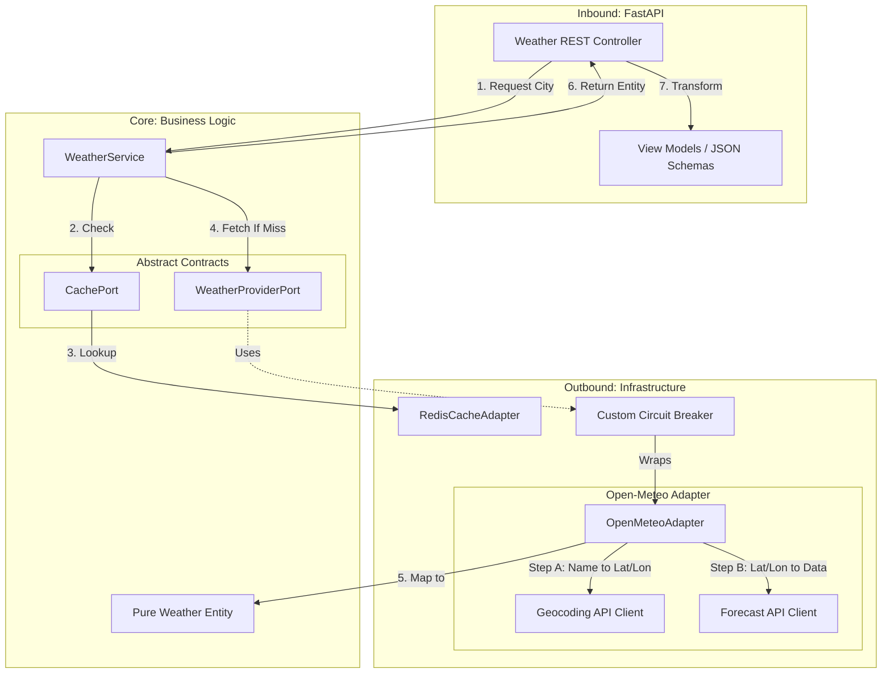

```mermaid
graph TD
    subgraph Inbound_Adapter [Inbound: FastAPI]
        API[Weather REST Controller]
        VM[View Models / JSON Schemas]
    end

    subgraph Core_Domain [Core: Business Logic]
        Service[WeatherService]
        Entity[Pure Weather Entity]
        
        subgraph Ports [Abstract Contracts]
            WPort[WeatherProviderPort]
            CPort[CachePort]
        end
    end

    subgraph Outbound_Adapters [Outbound: Infrastructure]
        subgraph Weather_Implementation [Open-Meteo Adapter]
            OM[OpenMeteoAdapter]
            Geo[Geocoding API Client]
            Forecast[Forecast API Client]
        end
        
        Redis[RedisCacheAdapter]
        CB[Custom Circuit Breaker]
    end

    %% Interactions
    API -->|1. Request City| Service
    Service -->|2. Check| CPort
    CPort -->|3. Lookup| Redis
    
    Service -->|4. Fetch If Miss| WPort
    WPort -.->|Uses| CB
    CB -->|Wraps| OM
    
    OM -->|Step A: Name to Lat/Lon| Geo
    OM -->|Step B: Lat/Lon to Data| Forecast
    
    OM -->|5. Map to| Entity
    Service -->|6. Return Entity| API
    API -->|7. Transform| VM
```
