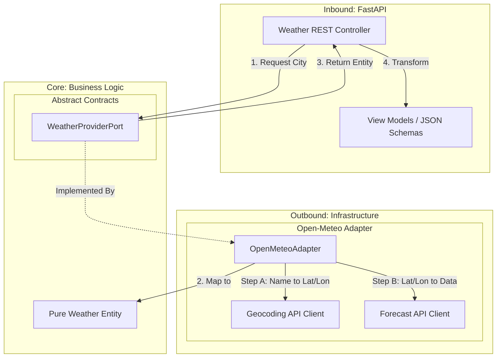

# Architecture Documentation

## Overview

The **Weather Proxy** is designed using **Hexagonal Architecture** (also known as Ports and Adapters). This architectural style was chosen to ensure the core business logic remains independent of external frameworks, databases, and third-party APIs (like Open-Meteo).

## Architectural Patterns

### 1. Hexagonal Architecture (Ports & Adapters)
The application is divided into three distinct layers:

*   **Core (The Hexagon)**: This is the heart of the application. It contains the **Domain Entities** (pure data structures) and **Ports** (interfaces). It knows *nothing* about the web framework or the external weather provider.
*   **Inbound Adapters (Primary/Driving)**: These are the entry points to the application. Currently, this is the **FastAPI** web layer (`api/`). It receives HTTP requests, converts them into domain calls, and maps the results back to HTTP responses (JSON).
*   **Outbound Adapters (Secondary/Driven)**: These are the implementations that talk to the outside world. Our **OpenMeteoProvider** (`infra/`) is an adapter that "plugs into" the core via the `WeatherProviderPort`.

### 2. Dependency Injection
We use Dependency Injection to wire the application together. The `main.py` entrypoint is responsible for instantiating the concrete adapters (e.g., `OpenMeteoProvider`) and injecting them into the application state. This makes testing easier, as we can easily swap in a `MockWeatherProvider` during tests.

## Data Flow Diagram

The following Mermaid diagram illustrates how a request flows through the system. Note that the caching layer (Redis) is planned for a future milestone.

## Component Breakdown

### Core Layer (`core/`)
*   **`domain/models.py`**: Defines `WeatherEntity`. This is the canonical representation of weather in our system.
*   **`domain/ports.py`**: Defines `WeatherProviderPort`. This Abstract Base Class (ABC) is the contract that any weather provider must fulfill.
*   **`domain/exceptions.py`**: Defines domain-specific errors like `CityNotFound`.

### Infrastructure Layer (`infra/`)
*   **`open_meteo.py`**: The concrete implementation of `WeatherProviderPort`. It handles the specifics of the Open-Meteo API (HTTP calls, JSON parsing, error mapping).
*   **`logging.py`**: Provides structured JSON logging configuration.

### API Layer (`api/`)
*   **`v1/schemas.py`**: Pydantic models (DTOs) for the public API. These act as the "View" in a Model-View-Controller sense.
*   **`middleware.py`**: Observability components (Request ID tracking, Logging).

## Design Decisions

*   **Async/Await**: The entire stack is asynchronous (FastAPI + `httpx`) to handle high concurrency, as the service is I/O bound (waiting for external API responses).
*   **Structured Logging**: We use JSON logging (`infra.logging`) to ensure logs are machine-readable and ready for ingestion by observability platforms (e.g., Datadog, ELK).
*   **Pydantic V2**: specific "View Models" (`WeatherResponse`) are used to decouple the internal `WeatherEntity` from the public API contract. This allows us to change the internal representation without breaking the public API.
